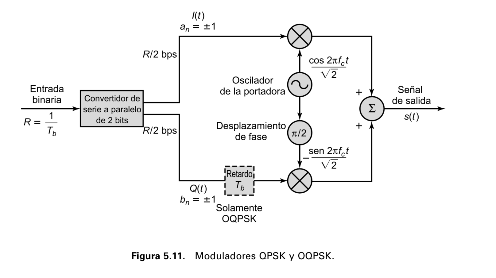
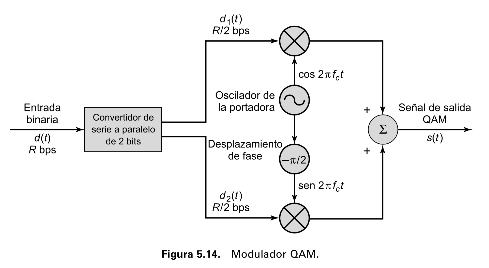

```{r setup, include=FALSE}
knitr::opts_chunk$set(echo = TRUE)
```


# Codificaciones analógicas {.block-skew}

Las codificaciones analógicas (ASK, FSK y PSK) vistas anteriormente pueden generalizarse al caso cuando se codifican más de $1$ bit. Si tomamos $2$ bits para codificar la información que llega, entonces podemos tener dos tipos más de codificaciones; QPSK y QAM. La codificación PSK vista anteriormente se define como:

$$
\mbox{BPSK}: \; \; s(t) = A d(t) \cos(2\pi f t)
$$
Mientras que si tomamos dos bits para codificar, se pueden obtener múltiples formas, dos de las cuales programaremos en este práctica; QPSK y QAM, las cuales toman la forma:
$$
\mbox{QPSK}: \; \;  s(t) = \frac{1}{\sqrt{2}}\left(I(t)\cos(2\pi ft)-Q(t)\sin(2\pi ft) \right)
$$
$$
\mbox{QAM}: \; \;  s(t) = d_1(t)\cos(2\pi ft)+d_2(t)\sin(2\pi ft)
$$

# Modulación QAM

La modulación QAM, se utiliza de forma usual en alguas redes inalámbricas y en redes ISDN y se puede considerar como una combinación de las técnicas ASK y PSK vistas anteriormemnte. En la siguiente figura se muestra un esquema de la modulación QPSK que implementaremos en R:

<center style="width=60%">

</center>

## Señal de información

Primero generamos la señal de información y la graficamos:

```{r info, fig.align="center", fig.cap="Bits de información. Estos bits serán codifcados por una o más señales analógicas."}
# Información original 1-111-1-1-1111
# Representación gráfica
xt <- c(1,-1,1,1,-1,-1,-1,1,1,1)
bits <- rep(xt, each=100)
time <- seq(0,2, length=length(bits))
plot(time, bits, type = "l", main="Secuencia de datos de información", xlab="Tiempo", ylab="Valores", ylim=c(-2,2))
```

Ahora se generan las señales $I(t)$ y $Q(t)$ que se multiplicarán con las señales seno y coseno y ponderadas mediante los valores $\frac{1}{\sqrt{2}}$, en R, éstas señales se generan y se grafican de la siguiente manera:

```{r itqt, fig.align='center', fig.cap="Señal QPSK codifcada mediante la señal de información y las señales $I(t)$ y $Q(t)$"}
xt       <- c(1,-1,1,1,-1,-1,-1,1,1,1)
bits     <- rep(xt, each=100)
it       <- xt[seq(1, length(xt), by=2)]
qt       <- xt[seq(2, length(xt), by=2)]
itbits   <- rep(it, each=200)
qtbits   <- rep(qt, each=200)
time <- seq(0,2, length=length(bits))
plot(time, bits+3, type = "l", main="Señales digitales en QPSK", xlab="Tiempo", ylab="Valores", ylim=c(-5,5))
lines(time, itbits, col="blue")
lines(time, qtbits-3, col = "red")
abline(h=3, lty="dashed")
abline(h=-3, lty="dashed")
abline(h=0, lty="dashed")
```

Finalmente, una vez generadas las señales $I(t)$ y $Q(t)$, se genera la señal QPSK de acuerdo a la relación:

$$
\mbox{QPSK}: \; \;  s(t) = \frac{1}{\sqrt{2}}\left(I(t)\cos(2\pi ft)-Q(t)\sin(2\pi ft) \right)
$$


```{r qpsk, fig.align="center", fig.cap ="Señal QPSK codificada mediante las señales $I(t)$ y $Q(t)$, las señales seno y coseno"}
xt       <- c(1,-1,1,1,-1,-1,-1,1,1,1)
bits     <- rep(xt, each=100)
it       <- xt[seq(1, length(xt), by=2)]
qt       <- xt[seq(2, length(xt), by=2)]
itbits   <- rep(it, each=200)
qtbits   <- rep(qt, each=200)
time     <- seq(0,2, length=length(bits))
sen2pi   <- sin(2*pi*5*time)
cos2pi   <- cos(2*pi*5*time)
st       <- 1/sqrt(2)*(itbits*cos2pi - qtbits*sen2pi)
plot(time, itbits+6, type = "l", main="Señales digitales en QPSK", xlab="Tiempo", ylab="Valores", ylim=c(-2,8))
lines(time, qtbits+3, col="red")
lines(time, bits, col="cyan", lty="dashed")
lines(time, st, col="blue")
```


# Modulación de amplitud en cuadratura

La modulación de amplitud en cuadratura es similar a la modulación QPSK y se puede generar de acuerdo al siguiente diagrama a bloques:

<center style="width=60%">

</center>

## Tareas

Programar la modulación de amplitud en cuadratura (QAM) siguiendo los mismos pasos que se presentaron para la modulación QPSK. Grafique de la misma manera que se hizo anteriormente.

# {.space}
